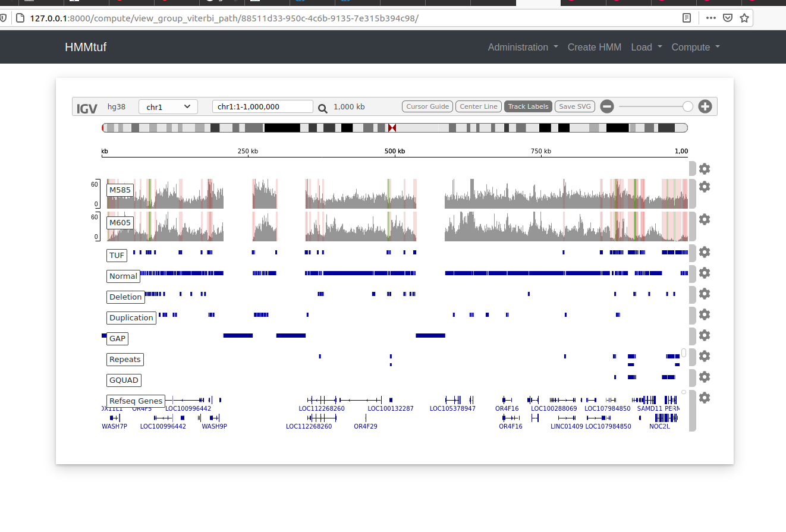
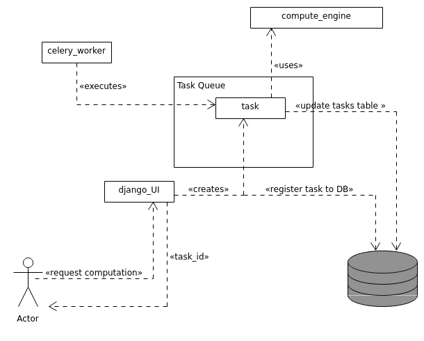

# hmmtuf

Thermodynamically ultra-fastened (TUF) regions are stretches of the DNA which fail to denature
even after the application of extreme melting conditions [1]. This behavior effectively reduces the amplification efficiency in these regions. 
It has also been reported that  TUF regions contain a core sequence which exhibits an increased GC concentration relative to the surrounding DNA. 
It is in fact these locally concentrated spikes of GC content which is believed to remain duplexed despite the application of denaturation processes [1].

Computational modelling and analysis of TUF regions requires the ability to somehow identify these in the 
DNA strand. However, visually, identifying and labeling TUF regions, although feasible, is time consuming to say the least. 

```hmmtuf``` is an simple mapping tool that uses <a href="https://en.wikipedia.org/wiki/Hidden_Markov_model">hidden Markov models</a> in order to label regions of DNA. Users can load
their own developed models. The application uses <a href="https://pomegranate.readthedocs.io/en/latest/">pomegranate</a> for
representing a hidden Markov model. We provide a default Markov model which can be found at ```hmmtuf_app/hmm_files/HMM1.json```. 
The report in ```hmmtuf_app/notes/hmmtuf_model_report.pdf``` describes how this model was developed.

The application currently supports the following computations

- Compute the <a href="https://en.wikipedia.org/wiki/Viterbi_algorithm">Viterbi path</a> of a single region
- Compute the Viterbi path over all regions of a chromosome
- Compute the repeats over a computed Viterbi path
- Compute distances between repeats
- Visualize distances distributions

The following image displays the marked windows accoding to the computed Viterbi path in the IGV browser.




The following schematic displays approximately the role of the various component.



## Dependencies

- <a href="https://www.djangoproject.com/">django</a>
- <a href="https://docs.celeryproject.org/en/stable/getting-started/introduction.html">celery</a>
- <a href="https://pomegranate.readthedocs.io/en/latest/">pomegranate</a>
- <a href="https://www.sqlite.org/index.html">SQLite</a> or <a href="#">MySQL</a>
- <a href="https://pysam.readthedocs.io/en/latest/api.html">pysam</a>
- <a href="https://biopython.org/">biopython</a>
- <a href="https://pypi.org/project/textdistance/">textdistance</a>


#### Note

You also need to install one of the backends supported by Celery. For more
information see <a href="https://docs.celeryproject.org/en/stable/getting-started/introduction.html#installation">here</a>.

## Configuration 

The general configuration is controlled by the ```config.py``` script in the ```hmmtuf/```
application directory. The following variables can be configured

- ```DEBUG``` 
- ```LOCAL_DEPLOY```
- ```SESSION_COOKIE_SECURE```
- ```CSRF_COOKIE_SECURE```
- ```USE_CELERY```
- ```ENABLE_SPADE```
- ```SPADE_PATH```
- ```DATA_PATH```
- ```USE_DJANGO_EXTENSIONS```

## Setup the project locally

1. ```cd``` to the top-level directory of the project i.e. where the ```manage.py``` file is located
2. Issue: ```python manage.py makemigrations```
3. Issue: ```python manage.py migrate```

The last two commands will setup the needed DB tables. You can now launch the development server.

Alternatively, you can apply migrations only for a specific application:

2. ```python manage.py makemigrations app_name```
3. ```python manage.py migrate app_name```

```
python manage.py runserver
```

## Setup ```admin``` site

1. Make sure that you have applied the migrations from ```admin``` and ```auth``` applications
2. Issue: ```python manage.py createsuperuser```
3. Fill in the details asked
4. Fire up the development server and visit ```http://127.0.0.1:8000/admin``` to login

## DB Handling

Currently, the project uses SQLite the default backend 
in Django. The following are some commands we can use during the
development

- Launch the ```dbshell```

```python manage.py dbshell```

- View tables and databases

```.tables```
```.databases```

- Drop all model tables

```python manage.py migrate zero``` 

## Monitoring Celery

You can use <a href="https://flower.readthedocs.io/en/latest/">flower</a> in order to monitor Celery

## Deploy with Apache with ```mod_wsgi```

Some instructions on how to deploy with Apache and ```mod_wsgi``` can be found <a href="https://pockerman.github.io/qubit_opus/programming/django/python/apache/web-development/2021/07/15/django-apache.html">here</a>.

## Deploy with Gunicorn

There are several tools that can be used for deployment. A common scenario is using 
<a href="https://gunicorn.org/">Gunicorn</a> a Python WSGI HTTP Server for UNIX and 
<a href="https://nginx.org/en/">nginx</a> an HTTP and reverse proxy server. 

You can find instructions how to deploy the application using Gunicorn and 
nginx <a href="https://www.digitalocean.com/community/tutorials/how-to-set-up-django-with-postgres-nginx-and-gunicorn-on-ubuntu-18-04">here</a>.
A minimum configuration that most likely is only suitable for local development/testing, can be:

#### gunicorn configuration

**gunicorn.socket** 

```
[Unit]
Description=gunicorn socket

[Socket]
ListenStream=/run/gunicorn.sock

[Install]
WantedBy=multi-user.target
```

**gunicorn.service**

```
[Unit]
Description=gunicorn daemon
Requires=gunicorn.socket
After=network.target

[Service]
User=alex
Group=www-data
WorkingDirectory=/path/to/hmmtuf
ExecStart=gunicorn --access-logfile - \
		  --workers 3 \
          --bind unix:/run/gunicorn.sock \
          hmmtuf.wsgi:application

[Install]
WantedBy=multi-user.target
```


#### nginx configuration

```
upstream app_server { 
server unix:/run/gunicorn.sock fail_timeout=0;
}

server {
	listen 80 default_server;
	listen [::]:80 default_server ipv6only=on;

	# set the correct hosts
	server_name localhost;

    access_log /path/to/where/logs/should/go/nginx-access.log;
    error_log /path/to/where/logs/should/go/nginx-error.log;

	location  /favicon.ico {
			access_log off; log_not_found off;
	}

	location /static {
		autoindex on;
        # this should point to where collectstatic
        # appends the files
		alias /path/to/hmmtuf/static;
	}

	location /viterbi_paths {
		autoindex on;
		alias /path/to/hmmtuf/viterbi_paths/;
	}

	location / {
		proxy_set_header X-Forwarded-For $proxy_add_x_forwarded_for;
		proxy_set_header Host $http_host;
		proxy_pass http://app_server;
	}
}
```

Provided that everything has worked, you can access the application at: ```http://localhost/```

## References

1. Colin D. Veal and Peter J. Freeman and  Kevin Jacobs and Owen Lancaster and Stéphane Jamain and Marion Leboyer and Demetrius Albanes and Reshma R. Vaghela and Ivo Gut and Stephen J. Chanock and Anthony J. Brookes, ```A mechanistic basis for amplification differences between samples and between genome regions```, BMC Genomics, 2012
2. Rabiner L. R., ```A tutorial on Hidden Markov Models and selected applications in speech recognition```,


